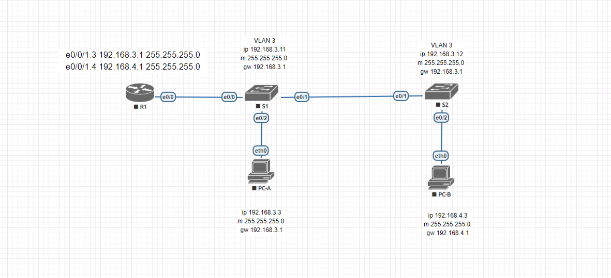

### Lab - Configure Router-on-a-Stick Inter-VLAN Routing

### Цели
1: Создание сети и настройка основных параметров устройств
2: Создание сетей VLAN и назначение портов коммутатора
3: Настройка магистрали 802.1Q между коммутаторами
4: Настройка маршрутизации между VLAN на маршрутизаторе
5: Проверка работы маршрутизации между VLAN

### Реализовать схему



### Таблица адресов

|Device|Interface|IP Address|Subnet Mask|Default Gateway
|---|---|---|---|---|
S1|VLAN3|192.168.3.11|255.255.255.0|192.168.3.1
S2|VLAN3|192.168.3.12|255.255.255.0|192.168.3.1
R1|e0/0.3|192.168.3.1|255.255.255.0|N/A|
-|e0/0.4|192.168.4.1|255.255.255.0|N/A|
-|e0/0.8|N/A|N/A|N/A|
PC-A|NIC|192.168.3.3|255.255.255.0|192.168.3.1
PC-B|NIC|192.168.4.3|255.255.255.0|192.168.4.1

### VLAN Таблица

|VLAN|Название|Связанные интерфейсы|Описание
|---|---|---|---|
3|Managment|S1:VLAN3, S1:e0/2, S2:VLAN3|Управление свичами и роутерами по ssh/telnet
4|Operations|S2:VLAN4, S2:e0/2|Конечные пользователи
7|ParkingLot|S1:e0/3, S2:e0/0,e0/3|Парковка погашенных портов, во имя security
8|Native|N/A|Нетегированный трафик 802.1Q, by default это VLAN1


### Подготовка стенда

### Базовые настройки


Для маршрутизатора:
```
Router>enable
Router#configure terminal
Enter configuration commands, one per line.  End with CNTL/Z.
Router(config)#hostname R1
R1(config)#no ip domain-lookup
R1(config)#enable secret class
R1(config)#line console 0
R1(config-line)#password cisco
R1(config-line)#login
R1(config-line)#line vty 0 4
R1(config-line)#password cisco
R1(config-line)#login
R1(config-line)#service password-encryption
R1(config)#banner motd #Unauthorized access is prohibited#
R1(config)#end
R1(config)#clock set 9:00:00 8 April 2024
R1(config)#exit
write memory


Для коммутатора:
```
Switch>enable
Switch#configure terminal
Switch(config)#hostname S1
S1(config)#no ip domain-lookup
S1(config)#enable secret class
S1(config)#line console 0
S1(config-line)#password cisco
S1(config-line)#login
S1(config-line)#line vty 0 4
S1(config-line)#password cisco
S1(config-line)#login
S1(config-line)#service password-encryption
S1(config)#banner motd #Unauthorized access is prohibited#
S1(config)#end
S1(config)#clock set 9:00:00 8 April 2024
S1(config)#exit
write memory
```


<details>
<summary>и при входе <b>в защищенный режим</b> – тоже попросят пароль</summary>

```
R1>enable
Password:
```
</details>

#### Настройка PC-A

```
VPCS> ip 192.168.3.3 255.255.255.0 192.168.3.1
Checking for duplicate address...
PC1 : 192.168.3.3 255.255.255.0 gateway 192.168.3.1
```

<details>
<summary> Проверка: </summary>

```
VPCS> ping 192.168.3.3

192.168.3.3 icmp_seq=1 ttl=64 time=0.001 ms
192.168.3.3 icmp_seq=2 ttl=64 time=0.001 ms
192.168.3.3 icmp_seq=3 ttl=64 time=0.001 ms
192.168.3.3 icmp_seq=4 ttl=64 time=0.001 ms
192.168.3.3 icmp_seq=5 ttl=64 time=0.001 ms
```
Проверка параметров:
```
VPCS> show ip

NAME        : VPCS[1]
IP/MASK     : 192.168.3.3/24
GATEWAY     : 192.168.3.1
DNS         :
MAC         : 00:50:79:66:68:04
LPORT       : 20000
RHOST:PORT  : 127.0.0.1:30000
MTU         : 1500

```
</details>

Default gateway пока недоступен:
```
VPCS> ping 192.168.3.1
host (192.168.3.1) not reachable
```


#### Настройка PC-B

<details>
<summary> аналогично PC-A </summary>

```
VPCS> ip 192.168.4.3 255.255.255.0 192.168.4.1
Checking for duplicate address...
PC1 : 192.168.4.3 255.255.255.0 gateway 192.168.4.1

VPCS> ping 192.168.4.3

192.168.4.3 icmp_seq=1 ttl=64 time=0.001 ms
192.168.4.3 icmp_seq=2 ttl=64 time=0.001 ms
192.168.4.3 icmp_seq=3 ttl=64 time=0.001 ms
192.168.4.3 icmp_seq=4 ttl=64 time=0.001 ms
192.168.4.3 icmp_seq=5 ttl=64 time=0.001 ms
```

</details>

### Настройка маршрутизации с использованием trunk


Соберем схему:


Объединим подсети на R1:
```
Router#configure terminal
Router(config)#interface Ethernet0/0.3
Router(config-subif)#encapsulation dot1Q 3
Router(config-subif)#ip address 192.168.3.1 255.255.255.0
Router(config-subif)#no shutdown
Router(config-subif)#exit

Router(config)#interface Ethernet0/0.4
Router(config-subif)#encapsulation dot1Q 4
Router(config-subif)#ip address 192.168.4.1 255.255.255.0
Router(config-subif)#no shutdown
Router(config-subif)#exit

Router(config)#exit
```
Поднимаем настроенный интерфейс:
```
Router#configure terminal
Router(config)#interface Ethernet 0/0
Router(config-if)#no shutdown
Router(config-if)#end
```

На свиче в транке разрешаем только используемые сети 3,4,8.<br>
Parking (vlan 7) должна быть зафильтрована (не разрешена).

S1:
```
Switch#configure terminal
Switch(config)#hostname S1
S1(config)#vlan 3
S1(config-vlan)#name Management
S1(config-vlan)#vlan 4
S1(config-vlan)#name Operations
S1(config-vlan)#vlan 7
S1(config-vlan)#name ParkingLot
S1(config-vlan)#vlan 8
S1(config-vlan)#name Native

S1(config)#interface range ethernet 0/0, ethernet 0/1
S1(config-if-range)#switchport trunk encapsulation dot1q
S1(config-if-range)#switchport mode trunk
S1(config-if-range)#switchport trunk native vlan 8
S1(config-if-range)#switchport trunk allowed vlan 3,4,8
S1(config-if-range)#end

S1(config-if)#interface ethernet 0/2
S1(config-if)#switchport mode access
S1(config-if)#switchport access vlan 3

S1(config-if)#interface ethernet 0/3
S1(config-if)#switchport mode access
S1(config-if)#switchport access vlan 7
```

```
S1#show vlan brief

VLAN Name                             Status    Ports
---- -------------------------------- --------- -------------------------------
1    default                          active
3    Management                       active    Et0/2
4    Operations                       active
7    ParkingLot                       active    Et0/3
8    Native                           active
1002 fddi-default                     act/unsup
1003 token-ring-default               act/unsup
1004 fddinet-default                  act/unsup
1005 trnet-default                    act/unsup
```

и добавим IP-адрес на коммутатор:

S1:
```
S1#configure terminal
S1(config)#interface vlan 3
S1(config-if)#ip address 192.168.3.11 255.255.255.0
S1(config-if)#no shutdown
*Mar 13 13:40:42.838: %LINK-3-UPDOWN: Interface Vlan3, changed state to up
*Mar 13 13:40:43.842: %LINEPROTO-5-UPDOWN: Line protocol on Interface Vlan3, changed state to up
*Mar 13 13:40:46.565: %SYS-5-CONFIG_I: Configured from console by console
S1(config-if)#end
```

```
S1#show ip interface brief
Interface              IP-Address      OK? Method Status                Protocol
Ethernet0/0            unassigned      YES unset  up                    up
Ethernet0/1            unassigned      YES unset  up                    up
Ethernet0/2            unassigned      YES unset  up                    up
Ethernet0/3            unassigned      YES unset  up                    up
Vlan3                  192.168.3.11    YES manual up                    up
```

<details>
<summary> Аналогично делаем на S2 </summary>

```
Switch#configure terminal
Switch(config)#hostname S2

S2(config)#vlan 3
S2(config-vlan)#name Management
S2(config-vlan)#vlan 4
S2(config-vlan)#name Operations
S2(config-vlan)#vlan 7
S2(config-vlan)#name ParkingLot
S2(config-vlan)#vlan 8
S2(config-vlan)#name Native
S2(config-vlan)#exit

S2(config)#interface Ethernet 0/1
S2(config-if)#switchport trunk encapsulation dot1q
S2(config-if)#switchport mode trunk
S2(config-if)#switchport trunk native vlan 8
S2(config-if)#switchport trunk allowed vlan 3,4,8
S2(config-if)#exit

S2(config-if)#int Ethernet 0/2
S2(config-if)#switchport mode access
S2(config-if)#switchport access vlan 4
S2(config-if)#exit

S2(config)#interface range ethernet 0/0, ethernet 0/3
S2(config-if-range)#switchport mode access
S2(config-if-range)#switchport access vlan 7
S2(config-if-range)#end
```

```
S2#show vlan brief

VLAN Name                             Status    Ports
---- -------------------------------- --------- -------------------------------
1    default                          active
3    Management                       active
4    Operations                       active    Et0/2
7    ParkingLot                       active    Et0/0, Et0/3
8    Native                           active
1002 fddi-default                     act/unsup
1003 token-ring-default               act/unsup
1004 fddinet-default                  act/unsup
1005 trnet-default                    act/unsup
```

</details>

Проверка с PC-A:
```
VPCS> show ip all

NAME   IP/MASK              GATEWAY           MAC                DNS
VPCS1  192.168.3.3/24       192.168.3.1       00:50:79:66:68:04

VPCS> ping 192.168.4.1

84 bytes from 192.168.4.1 icmp_seq=1 ttl=255 time=0.443 ms
84 bytes from 192.168.4.1 icmp_seq=2 ttl=255 time=0.462 ms
^C
VPCS> ping 192.168.4.3

84 bytes from 192.168.4.3 icmp_seq=1 ttl=63 time=1.726 ms
84 bytes from 192.168.4.3 icmp_seq=2 ttl=63 time=0.636 ms
^C
VPCS> ping 192.168.3.1

84 bytes from 192.168.3.1 icmp_seq=1 ttl=255 time=0.491 ms
84 bytes from 192.168.3.1 icmp_seq=2 ttl=255 time=0.419 ms
```

Проверка с PC-B:
```
VPCS> show ip all

NAME   IP/MASK              GATEWAY           MAC                DNS
VPCS1  192.168.4.3/24       192.168.4.1       00:50:79:66:68:05

VPCS> ping 192.168.3.3

84 bytes from 192.168.3.3 icmp_seq=1 ttl=63 time=1.646 ms
84 bytes from 192.168.3.3 icmp_seq=2 ttl=63 time=0.594 ms
84 bytes from 192.168.3.3 icmp_seq=3 ttl=63 time=0.563 ms
^C
```

